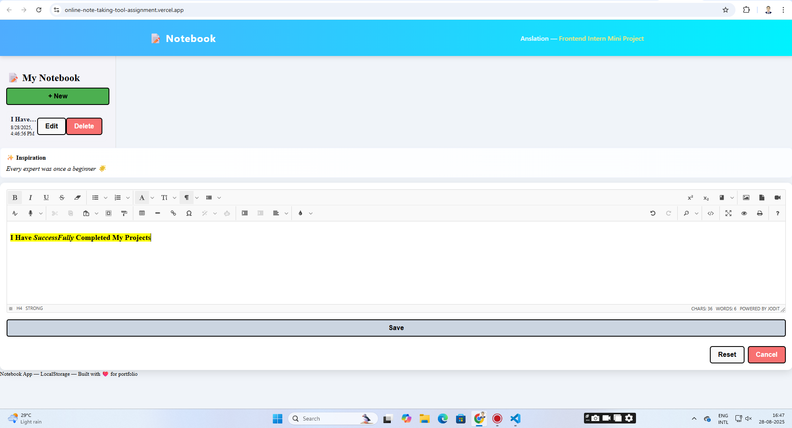

# 📝 Online Notebook App



## Tool Assigned
**Tool Name:** Notebook  
**Description:** Online note-taking tool.  

## Features
- Create and edit notes using a **rich text editor** (Jodit Editor).  
- Save notes **locally** using LocalStorage or optionally via a **backend API**.  
- Notes support **bold, italic, underline, colors, lists, links**, and more.  
- Filter notes by **date**.  
- Random **quote display** integrated via a free API (`https://api.quotable.io/random`).  
- Fully **responsive** and visually appealing design for **mobile and desktop**.  

## Requirements Implemented
- Built with **React.js**, HTML, and CSS.  
- LocalStorage acts as a **simulated API** for persisting notes.  
- Optionally, a **Node.js backend** can be used for CRUD operations.  
- Clean, modular, and commented code.  
- Fully responsive design with modern UI/UX.  

## How It Works
1. **Add a Note:** Click **`+ New`** to create a new note.  
2. **Edit Note:** Use the Jodit rich text editor to format your note.  
3. **Save Note:** Click **Save** — the note persists in LocalStorage (or backend) and displays immediately.  
4. **Delete Note:** Remove any note from the list.  
5. **Filter Notes:** Choose a date to filter notes by creation date.  
6. **Random Quotes:** The QuoteBox displays a motivational quote from the API.  

## Technologies Used
- **Frontend:** React.js, Jodit Editor, HTML, CSS  
- **Storage / API:** LocalStorage (simulated API) or Node.js backend (optional)  
- **API Integration:** Fetch API for random quotes  

## Backend Setup (Node.js)
If you want to use a backend instead of LocalStorage:

1. Create a `.env` file with necessary variables (if needed).  
2. Run the Node.js backend:
```bash
cd backend
npm install
node server.js
## Frontend Setup
npm install
npm start (frontend react)
